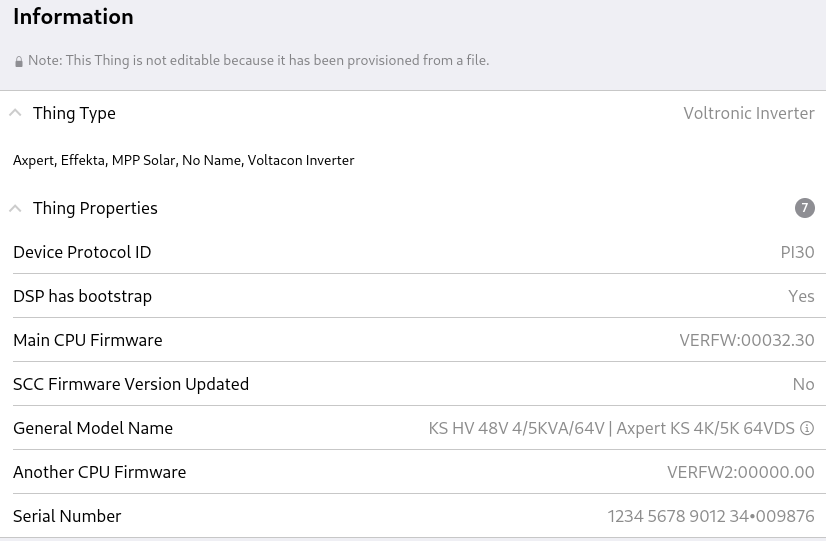
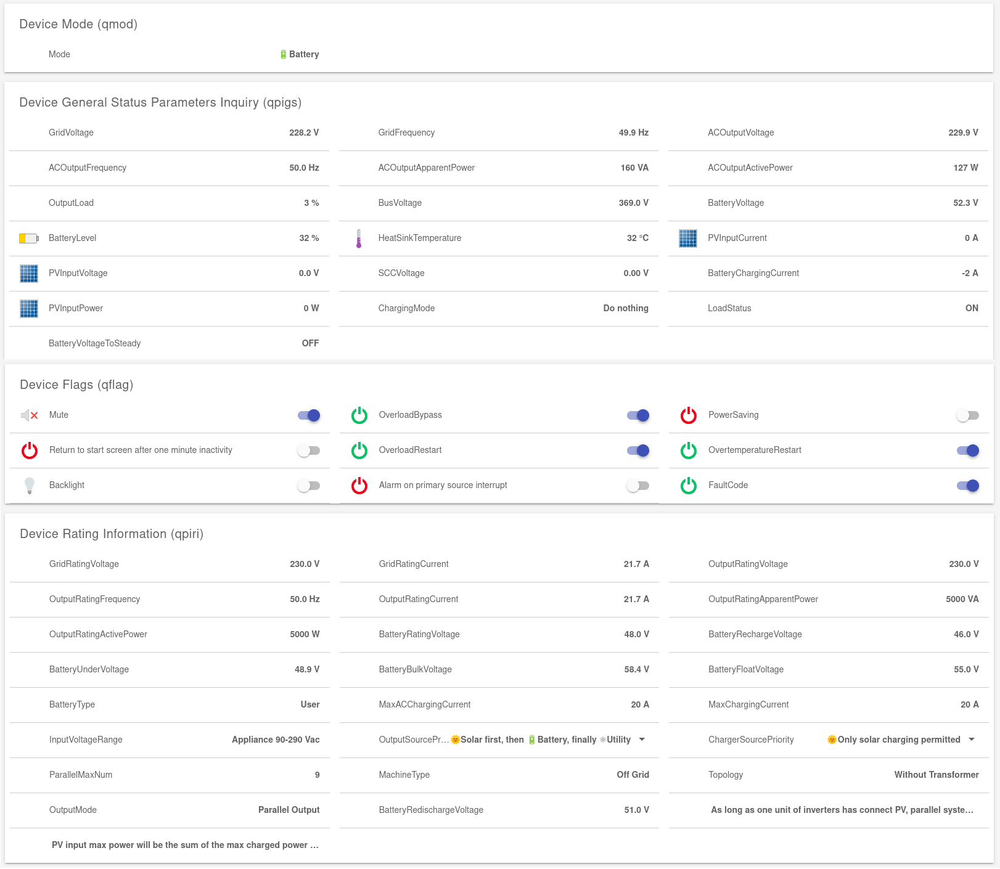

# Voltronic Inverters Binding

This binding reads data using USB cable with the PI30 protocol from Voltronic inverters, marketed as Axpert, Effekta, MPP Solar, No name, Voltacom and injects the information in openHAB channels.
It provides an action to send any command to the devices from openHAB.

## Communication over /dev/hidraw devices

When one end of an USB-B cable is connected in the Voltronic inverter and the other USB-A end in a Linux system, a /dev/hidraw device appears on the latter.
This binding is tested and can be configured only with such /dev/hidraw devices.
Creating a `/etc/udev/rules.d/hidraw.rules` file with content `SUBSYSTEM=="hidraw", ATTRS{idVendor}=="0665", ATTRS{idProduct}=="5161", GROUP="dialout"` ensures that members of the dialout group, to which the openhab user belongs, have sufficient access to communicate.

For the communication to work, the nrjavaserial library needs to be patched to deal with /dev/hidraw devices, by applying the changes from https://github.com/dilyanpalauzov/nrjavaserial/commits/master/.
The release https://github.com/dilyanpalauzov/nrjavaserial/releases/tag/5.2.1-hidraw does include these changes.
To install the modified nrjavaserial-5.2.1.jar, stop openhab, clean the openHAB cache, replace the file /usr/share/openhab/runtime/system/com/neuronrobotics/nrjavaserial/5.2.1.OH1/nrjavaserial-5.2.1.OH1.jar and finally start openHAB.

## Operating mode

The thing periodically polls information from the device, using the QMOD, QPIWS and QPIGS command, and pushes data to the channel groups with the same name.  For the operation of the binding it is irrelevant whether items are bound to channels.

When the thing goes online, it sends the QID, QSID, QVFW, QMN, QVFW2, QVFW3, QPI, VERFW, QWFS, QBOOT and QGMN commands.  From their answers the thing properties are built.

If QSID returns the same serial number as QID, but after the announced length there are non-zeroes, these are added as device property “Serial Number” after a bullet.
Then the 14-digit serial number returned by QID is the text before the bullet.


The QPIRI and QFLAG commands, which provide data for the channel groups with the same name, are also executed when the device goes online.
Changing a setting using the device’s buttons does not transfer the new state to openHAB.
If a setting is changed over a channel in the QPIRI or QFLAG channel groups, then QPIRI and QFLAG are executed and the statuses are transferred to openHAB.
That is, after making a change using the buttons on the device, it is sufficient to toggle the backlight from openHAB to transfer the new settings to openHAB.

Sometimes on supported commands the inverter returns NAK.  When this binding receives NAK, timeout or wrong CRC, it sends the command again. If it receives NAK, timeout or wrong CRC again it sends the command one last time.

## What does not work

* Parallel mode - querying several devices using one connection
* Not tested are all other kinds of connections - RS232, Bluetooth, Wi-Fi.
In fact no openHAB thing can be created for these.
* All battery equalization stuff
* Detecting which commands the inverter supports and in turn convert some channels from read-only to read-write.
Currently the only changes via channels are made by the PD/PE, PCP00, PCP01, POP00 and POP01 commands, as only these are supported by the inverter of the author of this binding.
However, as can be seen at the end of the current file, there is an action to send arbitrary commands to the inverter.
* Discovery of devices

### Known troubles

For the serial communication to work either under Settings → Add-On Management → USB Suggestion Finder must be enabled, or an add-on from the distribution, which utilizes serial communication, must be installed.

## Policy for accepting patches

Patches, adding new channels or converting a read-only channel to write-channel by sending a command, should first detect if the feature is available by the connected inverter, and not offer it for all inverters.

## Supported Things

`inverter`: This binding supports one thing type: Voltronic inverter.

## Thing Configuration

| Name            | Type    | Description                                 | Default | Required |
|-----------------|---------|---------------------------------------------|---------|----------|
| port            | text    | Where the connecting cable is plugged       | N/A     | yes      |
| refreshInterval | integer | Interval the device is polled in millisec.  | 750     | no       |

Example configuration file
```
Thing voltronic:inverter:f [port="/dev/hidraw0", refreshInterval="2000"]
```

## Channels

The provided channels are grouped, based on the command which provides data for the channel - QMOD, QPIGS, QPIWS, QFLAG, and QPIRI.

### Autoupdate is disabled

The current binding has disabled generating a predicted state, when a command changing a setting (PE, PD, POP and PCP) is sent to the inverter over a channel.
After sending the command, the binding queues the current state with the QFLAG and QPIRI commands and updates the channels with the new state.
If the inverter rejects (ignores, vetoes) the command, the initial state of the item does not change.
[BasicUI](https://github.com/openhab/openhab-webui/issues/3456) and [openHAB-Android with sitemaps](https://github.com/openhab/openhab-android/issues/3947) in such case show the state, which the user modified to, not the state, returned by the inverter.
Having `autoupdate="true"` below is necessary when using BasicUI or openHAB-Android with sitemaps, so that the item changes to the new state and then returns to the old one, when the inverter might reject the command.
Enabling Power Saving (PEj) is an example for a command, which inverters may ignore.

### The Channels

The descriptions can be read in the documentation from Voltronic for the respective command.
Channels are listed in the order the reply returns data.
The third column (T) contains R for Read-only channels or W for Read-Write channels.
Read-only means that the value may or may not be modifiable on the device or by the `voltronicSend()` action.

| Channel                         | Item Type                | T | Notes                    |
|---------------------------------|--------------------------|---|--------------------------|
| qmod#mode                       | String                   | R | Current operating mode   |
| qpiws#warnings                  | String                   | R | Warnings or empty string |
| qpiws#faults                    | String                   | R | Faults or empty string   |
| qpigs#gridVoltage               | Number:ElectricPotential | R |                          |
| qpigs#gridFrequency             | Number:Frequency         | R |                          |
| qpigs#outputVoltage             | Number:ElectricPotential | R |                          |
| qpigs#outputApparentPower       | Number:Power             | R | unit="VA"                |
| qpigs#outputActivePower         | Number:Power             | R |                          |
| qpigs#outputLoad                | Number:Dimensionless     | R | unit="%"                 |
| qpigs#busVoltage                | Number:ElectricPotential | R |                          |
| qpigs#batteryVoltage            | Number:ElectricPotential | R |                          |
| qpigs#batteryLevel              | Number:Dimensionless     | R | unit="%"                 |
| qpigs#heatSinkTemperature       | Number:Temperature       | R |                          |
| qpigs#inputCurrent              | Number:ElectricCurrent   | R | Integer                  |
| qpigs#inputVoltage              | Number:ElectricPotential | R |                          |
| qpigs#sccVoltage                | Number:ElectricPotential | R |                          |
| qpigs#batteryChargingCurrent    | Number:ElectricCurrent   | R | Integer                  |
| qpigs#inputPower                | Number:Power             | R |                          |
| qpigs#chargingMode              | String                   | R |                          |
| qpigs#loadStatus                | Switch                   | R |                          |
| qpigs#batteryVoltageToSteady    | Switch                   | R |                          |
| qflag#mute                      | Switch                   | W | Buzzer disabled/enabled  |
| qflag#overloadBypass            | Switch                   | W | Menu item 18             |
| qflag#powerSaving               | Switch                   | W | Menu item 04             |
| qflag#lcdReturn                 | Switch                   | W | Menu item 19             |
| qflag#overloadRestart           | Switch                   | W | Menu item 06             |
| qflag#overtemperatureRestart    | Switch                   | W | Menu item 07             |
| qflag#backlight                 | Switch                   | W | Menu item 20             |
| qflag#alarm                     | Switch                   | W | Menu item 22             |
| qflag#faultCode                 | Switch                   | W | Menu item 25             |
| qpiri#gridRatingVoltage         | Number:ElectricPotential | R |                          |
| qpiri#gridRatingCurrent         | Number:ElectricCurrent   | R |                          |
| qpiri#outputRatingVoltage       | Number:ElectricPotential | R |                          |
| qpiri#outputRatingFrequency     | Number:Frequency         | R | Menu item 09             |
| qpiri#outputRatingCurrent       | Number:ElectricCurrent   | R |                          |
| qpiri#outputRatingApparentPower | Number:Power             | R | unit="VA"                |
| qpiri#outputRatingActivePower   | Number:Power             | R |                          |
| qpiri#batteryRatingVoltage      | Number:ElectricPotential | R |                          |
| qpiri#batteryRechargeVoltage    | Number:ElectricPotential | R | Menu item 12             |
| qpiri#batteryUnderVoltage       | Number:ElectricPotential | R | Menu item 29             |
| qpiri#batteryBulkVoltage        | Number:ElectricPotential | R | Menu item 26             |
| qpiri#batteryFloatVoltage       | Number:ElectricPotential | R | Menu item 27             |
| qpiri#batteryType               | String                   | R | Menu item 05             |
| qpiri#maxACChargingCurrent      | Number:ElectricCurrent   | R | Menu item 11             |
| qpiri#maxChargingCurrent        | Number:ElectricCurrent   | R | Menu item 02             |
| qpiri#inputVoltageRange         | Switch                   | R | Menu item 03             |
| qpiri#outputSourcePriority      | Number:Dimensionless     | W | Menu item 01             |
| qpiri#chargerSourcePriority     | Number:Dimensionless     | W | Menu item 16             |
| qpiri#parallelMaxNum            | Number:Dimensionless     | R |                          |
| qpiri#machineType               | String                   | R |                          |
| qpiri#topology                  | Switch                   | R |                          |
| qpiri#outputMode                | String                   | R | Menu item 28             |
| qpiri#batteryRedischargeVoltage | Number:ElectricPotential | R | Menu item 13             |
| qpiri#pvConditionForParallel    | Switch                   | R |                          |
| qpiri#pvPowerBalance            | Switch                   | R | Menu item 31             |

## Full Example

### Thing Configuration

```java
Thing voltronic:inverter:f [port="/dev/hidraw0"]
```

### Item Configuration

#### Tags in .items file definitions

Since openHAB 5.1 when services/runtime.cfg:org.openhab.ItemChannelLinkRegistry:useTags=true is set, tags are inherited from the binding and the text between [], when not applied to a Group (first two lines below), can be skipped.  Since openHAB 5.1 the quotes around Switch can be skipped.

The tags Calculation, Mode and Info are recognized since openHAB 5.0.
Use Calculation instead of Measurement for qpigs#inputPower, when the display does not show and the device does not transmit the power from PV.
In this case inputPower is calculated as the product of qpigs#inputCurrent and qpigs#sccVoltage.

### Sample Items Configuration

```java
// autoupdate="true" is only needed for sitemaps and only in the case when the device can reject a change

Group gInverter1 [Inverter]
Group gBattery1 (gInverter1) [Battery]

String Mode <none> (gInverter1) [Status, Mode] { channel="voltronic:inverter:f:qmod#mode" }
String Warnings <alarm> (gInverter1) [Alarm, Info] { channel="voltronic:inverter:f:qpiws#warnings" }
String Faults <alarm> (gInverter1) [Alarm, Info] { channel="voltronic:inverter:f:qpiws#faults" }

Switch Mute <soundvolume_mute> (gInverter1) ["Switch", SoundVolume] { channel="voltronic:inverter:f:qflag#mute", autoupdate="true" }
Switch OverloadBypass (gInverter1) ["Switch", Mode] { channel="voltronic:inverter:f:qflag#overloadBypass", autoupdate="true" }
Switch PowerSaving (gInverter1) ["Switch", Mode] { channel="voltronic:inverter:f:qflag#powerSaving", autoupdate="true" }
Switch LCDReturn "Return to start screen after one minute inactivity" (gInverter1) ["Switch", Mode] { channel="voltronic:inverter:f:qflag#lcdReturn", autoupdate="true" }
Switch OverloadRestart (gInverter1) ["Switch", Mode] { channel="voltronic:inverter:f:qflag#overloadRestart", autoupdate="true" }
Switch OvertemperatureRestart (gInverter1) ["Switch", Mode] { channel="voltronic:inverter:f:qflag#overtemperatureRestart", autoupdate="true" }
Switch Backlight <light> (gInverter1) ["Switch", Light] { channel="voltronic:inverter:f:qflag#backlight", autoupdate="true" }
Switch Alarm "Alarm on primary source interrupt" (gInverter1) ["Switch", Mode] { channel="voltronic:inverter:f:qflag#alarm", autoupdate="true" }
Switch FaultCode (gInverter1)  ["Switch", Mode] { channel="voltronic:inverter:f:qflag#faultCode", autoupdate="true" }

Number:ElectricPotential GridVoltage (gInverter1) [Measurement, Voltage] { channel="voltronic:inverter:f:qpigs#gridVoltage" }
Number:Frequency GridFrequency (gInverter1) [Measurement, Frequency] { channel="voltronic:inverter:f:qpigs#gridFrequency" }
Number:ElectricPotential ACOutputVoltage (gInverter1) [Measurement, Voltage] { channel="voltronic:inverter:f:qpigs#outputVoltage" }
Number:Frequency ACOutputFrequency (gInverter1) [Measurement, Frequency] { channel="voltronic:inverter:f:qpigs#outputFrequency" }
Number:Power ACOutputApparentPower (gInverter1) [Measurement, Power] { channel="voltronic:inverter:f:qpigs#outputApparentPower", unit="VA" }
Number:Power ACOutputActivePower (gInverter1) [Measurement, Power] { channel="voltronic:inverter:f:qpigs#outputActivePower" }
Number:Dimensionless OutputLoad (gInverter1) [Measurement, Info] { channel="voltronic:inverter:f:qpigs#outputLoad", unit="%" }
Number:ElectricPotential BusVoltage (gInverter1) [Measurement, Voltage] { channel="voltronic:inverter:f:qpigs#busVoltage" }
Number:ElectricPotential BatteryVoltage (gBattery1) [Measurement, Voltage] { channel="voltronic:inverter:f:qpigs#batteryVoltage" }
Number:Dimensionless BatteryLevel <battery> (gBattery1) [Measurement, Energy] { channel="voltronic:inverter:f:qpigs#batteryLevel", unit="%" }
Number:Temperature HeatSinkTemperature <temperature> (gInverter1) [Measurement, Temperature] { channel="voltronic:inverter:f:qpigs#heatSinkTemperature" }
Number:ElectricCurrent PVInputCurrent <solarplant> (gInverter1) [Measurement, Current] { channel="voltronic:inverter:f:qpigs#inputCurrent" }
Number:ElectricPotential PVInputVoltage <solarplant> (gInverter1) [Measurement, Voltage] { channel="voltronic:inverter:f:qpigs#inputVoltage" }
Number:ElectricPotential SCCVoltage (gInverter1) [Measurement, Voltage] { channel="voltronic:inverter:f:qpigs#sccVoltage" }
Number:ElectricCurrent BatteryChargingCurrent (gBattery1) [Measurement, Current] { channel="voltronic:inverter:f:qpigs#batteryChargingCurrent" }
Number:Power PVInputPower <solarplant> (gInverter1) [Measurement, Power] { channel="voltronic:inverter:f:qpigs#inputPower" }
String ChargingMode (gInverter1) [Status, Mode] { channel="voltronic:inverter:f:qpigs#chargingMode" }
Switch LoadStatus (gInverter1) [Status, Mode] { channel="voltronic:inverter:f:qpigs#loadStatus" }
Switch BatteryVoltageToSteady (gInverter1) [Status, Mode] { channel="voltronic:inverter:f:qpigs#batteryVoltageToSteady" }

Number:ElectricPotential GridRatingVoltage (gInverter1) [Status, Voltage] { channel="voltronic:inverter:f:qpiri#gridRatingVoltage" }
Number:ElectricCurrent GridRatingCurrent (gInverter1) [Status, Current] { channel="voltronic:inverter:f:qpiri#gridRatingCurrent" }
Number:ElectricPotential OutputRatingVoltage (gInverter1) [Status, Voltage] { channel="voltronic:inverter:f:qpiri#outputRatingVoltage" }
Number:Frequency OutputRatingFrequency (gInverter1) [Status, Frequency] { channel="voltronic:inverter:f:qpiri#outputRatingFrequency" }
Number:ElectricCurrent OutputRatingCurrent (gInverter1) [Status, Current] { channel="voltronic:inverter:f:qpiri#outputRatingCurrent" }
Number:Power OutputRatingApparentPower (gInverter1) [Status, Power] { channel="voltronic:inverter:f:qpiri#outputRatingApparentPower", unit="VA" }
Number:Power OutputRatingActivePower (gInverter1) [Status, Power] { channel="voltronic:inverter:f:qpiri#outputRatingActivePower" }
Number:ElectricPotential BatteryRatingVoltage (gInverter1) [Status, Voltage] { channel="voltronic:inverter:f:qpiri#batteryRatingVoltage" }
Number:ElectricPotential BatteryRechargeVoltage (gBattery1) [Setpoint, Voltage] { channel="voltronic:inverter:f:qpiri#batteryRechargeVoltage" }
Number:ElectricPotential BatteryUnderVoltage (gBattery1) [Setpoint, Voltage] { channel="voltronic:inverter:f:qpiri#batteryUnderVoltage" }
Number:ElectricPotential BatteryBulkVoltage (gBattery1) [Setpoint, Voltage] { channel="voltronic:inverter:f:qpiri#batteryBulkVoltage" }
Number:ElectricPotential BatteryFloatVoltage (gBattery1) [Setpoint, Voltage] { channel="voltronic:inverter:f:qpiri#batteryFloatVoltage" }
String BatteryType <none> (gBattery1) [Setpoint, Mode] { channel="voltronic:inverter:f:qpiri#batteryType" }
Number:ElectricCurrent MaxACChargingCurrent (gInverter1) [Setpoint, Current] { channel="voltronic:inverter:f:qpiri#maxACChargingCurrent" }
Number:ElectricCurrent MaxChargingCurrent (gInverter1) [Setpoint, Current] { channel="voltronic:inverter:f:qpiri#maxChargingCurrent" }
Switch InputVoltageRange <none> (gInverter1) ["Switch", Mode] { channel="voltronic:inverter:f:qpiri#inputVoltageRange" }
Number:Dimensionless OutputSourcePriority <none> (gInverter1) [Setpoint, Mode] { channel="voltronic:inverter:f:qpiri#outputSourcePriority" }
Number:Dimensionless ChargerSourcePriority <none> (gInverter1) [Setpoint, Mode] { channel="voltronic:inverter:f:qpiri#chargerSourcePriority" }
Number:Dimensionless ParallelMaxNum (gInverter1) [Status, Mode] { channel="voltronic:inverter:f:qpiri#parallelMaxNum" }
String MachineType <none> (gInverter1) [Status, Mode] { channel="voltronic:inverter:f:qpiri#machineType" }
Switch Topology <none> (gInverter1) [Status, Mode] { channel="voltronic:inverter:f:qpiri#topology" }
String OutputMode <none> (gInverter1) [Setpoint, Mode] { channel="voltronic:inverter:f:qpiri#outputMode" }
Number:ElectricPotential BatteryRedischargeVoltage (gBattery1) [Setpoint, Voltage] { channel="voltronic:inverter:f:qpiri#batteryRedischargeVoltage" }
Switch PVConditionForParallel <none> (gInverter1) ["Switch", Mode] { channel="voltronic:inverter:f:qpiri#pvConditionForParallel" }
Switch PVPowerBalance <none> (gInverter1) ["Switch", Mode] { channel="voltronic:inverter:f:qpiri#pvPowerBalance" }
```

### Sitemap Configuration

```perl
sitemap i1 label="i1" {
  Frame label="Device Mode (qmod)" {
    Text item=Mode
  }
  Frame label="Device General Status Parameters Inquiry (qpigs)" {
    Text item=GridVoltage
    Text item=GridFrequency
    Text item=ACOutputVoltage
    Text item=ACOutputFrequency
    Text item=ACOutputApparentPower
    Text item=ACOutputActivePower
    Text item=OutputLoad
    Text item=BusVoltage
    Text item=BatteryVoltage
    Text item=BatteryLevel
    Text item=HeatSinkTemperature
    Text item=PVInputCurrent
    Text item=PVInputVoltage
    Text item=SCCVoltage
    Text item=BatteryChargingCurrent
    Text item=PVInputPower
    Text item=ChargingMode icon=""
    Text item=LoadStatus icon=""
    Text item=BatteryVoltageToSteady icon=""
  }
  Frame label="Warnings and Faults (qpiw)" visibility=[Warnings!="" AND Warnings!=NULL, Faults!="" AND Faults != NULL] {
    Text item=Warnings visibility=[!=""]
    Text item=Faults visibility=[!=""]
  }
  Frame label="Device Flags (qflag)" {
    Switch item=Mute
    Switch item=OverloadBypass
    Switch item=PowerSaving
    Switch item=LCDReturn
    Switch item=OverloadRestart
    Switch item=OvertemperatureRestart
    Switch item=Backlight
    Switch item=Alarm
    Switch item=FaultCode
  }
  Frame label="Device Rating Information (qpiri)" {
    Text item=GridRatingVoltage
    Text item=GridRatingCurrent
    Text item=OutputRatingVoltage
    Text item=OutputRatingFrequency
    Text item=OutputRatingCurrent
    Text item=OutputRatingApparentPower
    Text item=OutputRatingActivePower
    Text item=BatteryRatingVoltage
    Text item=BatteryRechargeVoltage
    Text item=BatteryUnderVoltage
    Text item=BatteryBulkVoltage
    Text item=BatteryFloatVoltage
    Text item=BatteryType
    Text item=MaxACChargingCurrent
    Text item=MaxChargingCurrent
    Text item=InputVoltageRange
    Selection item=OutputSourcePriority
    Selection item=ChargerSourcePriority
    Text item=ParallelMaxNum
    Text item=MachineType
    Text item=Topology
    Text item=OutputMode
    Text item=BatteryRedischargeVoltage
    Text item=PVConditionForParallel
    Text item=PVPowerBalance 
  }
} 
```


Output source priority and Charger source priority values can be set from the sitemap:


## Actions

The `voltronicSend()` action sends a command to the inverter and returns the answer.  It returns `null` if there is a timeout (disconnected cable); or empty string, if the device answers but the CRC does not match.  Otherwise it delivers what the inverter answered.
```
val voltronicActions = getActions("voltronic", "voltronic:inverter:f") // second parameter must be thing name
logError("vi",  voltronicActions.voltronicSend("QPIRI"))
```